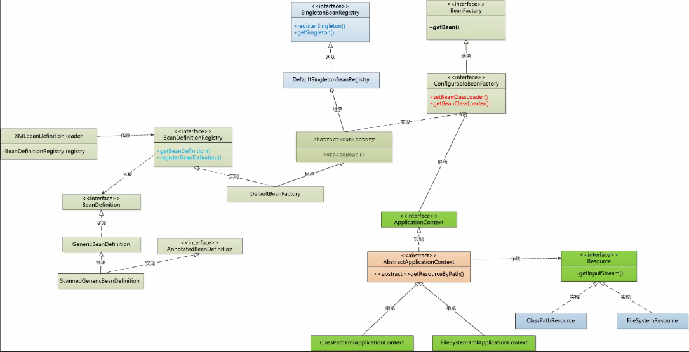

# 第一节：BeanFactory

类图： 


# 第二节：setter 注入

- **设计数据结构 PropertyValue**

  > 
  >
  > - RuntimeBeanReference
  > - TypedStringValue

- **用 BeanDefinitionResolver 去 resolve** RuntimeBeanReference 和 TypedStringValue

- **使用 TypeConverter 进行字符值转型**

  > 
  >
  > **使用 commons-beanUtils 进行转型**(替代)：
  >
  > `BeanUtils.setProperty(bean, propertyName, propertyValue)`：
  >
  > - `bean`：Java 对象，例如 petStore
  > - `propertyName`： 例如 version、accountDao
  > - `propertyValue`： 例如 3、accountDao 对象

# 第三节：构造器注入

和 setter 注入类似： 

- **设计一个数据结构 PropertyValue/ConstructorArgument** 

  > 
  >
  > 

- **解析 XML，填充该数据结构** 

- **利用该数据结构存放获取的 bean 信息** 

---

**多个构造函数的处理**：


**ConstructorResolver 实现下述要求**： 

- **根据参数个数进行匹配**
- **检查参数类型是否对应匹配**
- **基本类型是否能转型为对应匹配** 


# 第四节：spring 注解

- **读取 XML 文件**：`<context:component-scan base-package="xxx"/>`

- **对指定的 package 进行扫描(scan)，找到标记为 `@Component` 的类，创建 `BeanDefinition`** 

  - **把一个 package 下面的 class 变成 resource**，即： **加载指定 package 下的类文件并封装为 resource** 

  - **使用 ASM 读取 Annotation 注解** 

    > **ASM**：可以操作 Java 字节码的框架，可以读取和修改 class 文件中的字节码
    >
    > 工作模式： Class Reader(ASM 提供)、Class Visitor(用户自己实现)、Class Writer(暂不考虑)
    >
    > 
    >
    > **流程时序图**： 
    >
    > 

  - **创建 `BeanDefinition`** 

- **通过 `BeanDefinition` 创建 Bean 实例，根据注解来注入** 

---

**类注解注入： `@Component`** 

- **通过 ASM 读取注解**： 


- **使用 `SimpleMetadataReader` 封装复杂的 Visitor**


- **引入 `AnnotatedBeanDefinition` 和 `ScannedGenericBeanDefinition` 来返回 `AnnotationMetadata`**


- **`ClassPathBeanDefinitionScanner`： 获取 `@Component` 注解的类信息** 
  - 给定一个 package 的名称列表，如： com.litespring.dao.v4,com.litespring.service.v4
  - 对指定的 package 进行扫描(scan)，找到标记为 `@Component` 的类，创建 `ScannedGenericBeanDefinition`，并注册到 `BeanFactory` 中

- **获取注解注入下的 beanID**：


---

**字段注解注入： `@Autowired`**，即根据 Class 类型从 BeanFactory 获取一个对象，然后注入

- **Spring 抽象： DependencyDescriptor** 

  

  > 注： **只支持 Field 注入，并不去实现 MethodParameter**，本次不实现 MethodParameter

- **新接口： AutowireCapableBeanFactory**，用来封装 DependencyDescriptor

  

- **用一个类 `InjectionMetadata` 来封装 injection 过程** 

  

  

- **`AutowiredAnnotationProcessor` 可以把一个 Class 变成 `InjectionMetadata`** 

- **调用 `InjectionMetadata` 的 inject 方法，即可完成 injection**

  > **`AutowireCapableBeanFactory` 提供了 `resolveDependency` 方法**

---

**Bean 的生命周期**：


**Bean 生命周期的“钩子”函数**： 


**`InstantiationAwareBeanPostProcessor` 的继承实现路径**： 


**怎么使用 `PostProcessor`(多个注解对应多个 PostProcessor)**：

- 找个地方创建 PostProcessor： `AbstractApplicationContext`
- 需要能加到 BeanFactory： `ConfigurableBeanFactory`
- 在合适的地方调用： `DefaultBeanFactory.populateBean()` 

# 第五节：aop

实现 AOP： 

- **编译器“增强”代码**： AspectJ，即在编译时把日志、安全、事务等功能织入业务类

- **运行期修改** 

  > 问题： Class 一旦装入方法区就无法更改
  >
  > 解决： **运行时动态生成类**
  >
  > - 方式一： **子类继承方式** 
  >
  >   
  >
  > - 方式二： **接口方式** 
  >
  >   

---

- **从最简单的 pointcut 开始**： 

  

- **定位 Method**： 

   

---

**AOP 实现**： **实现指定次序的链式调用**，即给定一个对象(petStoreService)和方法(placeOrder) + 若干拦截器

目标： 拦截器能以正确的次序执行，如： BeforeXXX --> placeOrder --> AfterXXX

- **AOP Alliance 定义的拦截器**：

  

- **spring 定义的拦截器**： 

  

- **拦截器按次序执行**： `ReflectiveMethodInvocation`

  

- **AopProxy 实现**： **链式调用+CGLib**，通过 Factory 获得代理实例

  > 即：给定一个 AOPConfig，使用 Cglib 生成一个对象的代理
  
  

---

最后一个准备工作： **从 XML 中创建 BeanDefinition**

- 之前的 bean 定义

  ```xml
  <bean id="petStore" class="com.litespring.service.v1.PetStoreService"/>
  ```

  

- 现在的 bean 定义

  ```xml
  <aop:config>
  	<aop:aspect ref="tx">
      	<aop:pointcut id="placeOrder" expression=
                   "execution(* com.litespring.service.v5.*.placeOrder(..))"/>
          <aop:before pointcut-ref="placeOrder" method="start"/>
          <aop:after-returning  pointcut-ref="placeOrder" method="commit"/>
          <aop:after-throwing pointcut-ref="placeOrder" method="rollback"/>
      </aop:aspect>
  </aop:config>
  ```

  

  **更详细**：**这种 Bean 的定义并不是从 XML 中直接获得**，而是经过人工的“合成”(Synthetic)

  

  **类型不匹配时，Spring 的解决方法**： 

  

---

**Bean 的生命周期**： **组装代理** 


# 第六节：JDK 代理


# 主要类图

**litespring 的主要类图**： 



**spring 的主要类图**：

- **BeanFactory 类图**：


- **ApplicationContext 类图**： 

